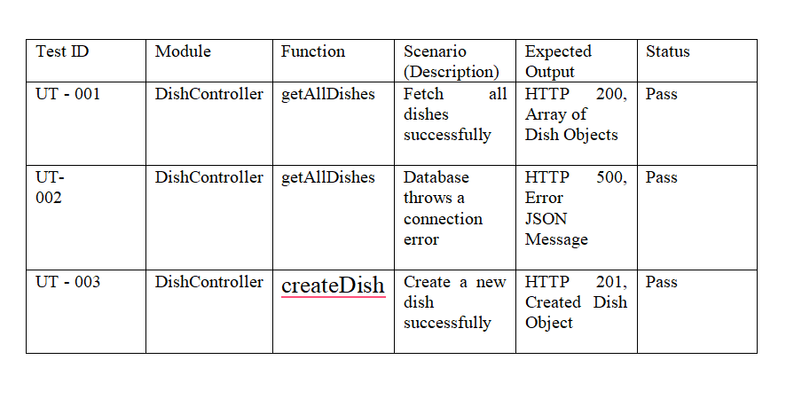
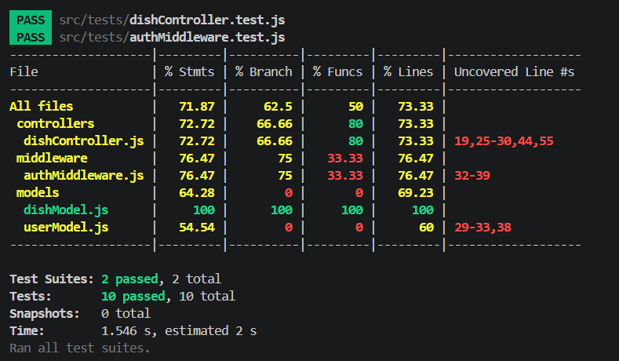

Markdown
2. # RESTful API Activity - Janna Mae V. Linga
3. ## Best Practices Implementation
4. **1. Environment Variables:**
5. - Why did we put `BASE_URI` in `.env` instead of hardcoding it?
6. - Answer: We put base_url in .env to avoid configuration values in the source code.

7. **2. Resource Modeling:**
8. - Why did we use plural nouns (e.g., `/dishes`) for our routes?
9. - Answer: We use plural nouns for our routes to represent the collections of resources.

11. - When do we use `201 Created` vs `200 OK`?
12. - Answer: 201 Created is use when a new resource is successfully created while 200 OK is use when a request is successful but it does not create new resource.
13. - Why is it important to return `404` instead of just an empty array or a generic error?
14. - Answer: Returning 404 Not Found allows the client to know that the requested resource does not exist.
15.
16. **4. Testing:**
(Paste a screenshot of a successful GET request here) 

------------------------------------------------------------------

ACTIVITY 3
Deliverable - Janna Mae V. Linga BSI/T 3D

1. Why did I choose to Embed the [Review/Tag/Log]?
Answer: I choose to embed the review because they are closely related to the parent document and don’t need to exist independently
2. Why did I choose to Reference the [Chef/User/Guest]?
Answer: I choose to reference the chef to avoids duplication and keeps the database normalized.

-------------------------------------------------------------------------------
ACTIVITY 4

1. Authentication vs Authorization:
o What is the difference between Authentication and Authorization in our
code?
o Answer: Authentication checks who you are while Authorization checks the user permission.
2. Security (bcrypt):
o Why did we use bcryptjs instead of saving passwords as plain text in
MongoDB?
o Answer: We use bcryptjs to hash passwords so that plain text passwords are not stored in the database. This will keep the user account safe.
3. JWT Structure:
o What does the protect middleware do when it receives a JWT from the
client?
o Answer: The protect middleware checks for a JWT token in the request header to identify the user. It then verifies the token using the server’s secret key to ensure it’s valid and not tampered with. Finally, it attaches the user information to req.user so protected routes know who is making the request.

-------------------------------------------------------------------------------
ACTIVITY 5

1. [ ] Code runs via npm run test:coverage with all tests passing (Green).
2. [ ] The Jest Coverage Table is copied and pasted into your README.
3. [ ] The Formal Unit Test Documentation Table (from Part 5) is completed and included in
your README.
4. [ ] GitHub Repo link submitted.

Essay Questions:
1. Mocking:
o Explain in your own words why we mocked Dish.find and jwt.verify. What
specific problem does mocking solve in Unit Testing?
o Answer: Mocking in unit testing replaces real dependencies like databases (e.g., Dish.find) or external libraries with fake versions. We mocked database queries to avoid real MongoDB dependencies and authentication token validation (jwt.verify) to simulate valid/invalid scenarios consistently. This solves dependency isolation, making tests faster, more reliable, and independent of external systems like databases, APIs, or authentication services.

2. Code Coverage:
o Look at your Jest Coverage report. Explain what % Branch coverage means. If your
Branch coverage is at 50%, what does that tell you about your tests? (Hint: Think
about if/else statements).
o Answer: Branch coverage measures tested decision paths (e.g., if, else, switch, error-handling). A 50% branch coverage means only half of the paths were tested. For instance, a successful 'if' condition might be tested, but not the 'else' or error scenario. This leaves logical paths untested, increasing the risk of hidden bugs under unexpected situations.

3. Testing Middleware:
o In our authMiddleware.test.js, why did we use jest.fn() for the next variable, and
why did we assert expect(next).not.toHaveBeenCalled() in the failure scenario?
o Answer: We asserted expect(next).not.toHaveBeenCalled() in the failure scenario to ensure that unauthorized users are blocked from accessing protected routes. If authentication fails, the middleware should stop the request and return an error response instead of allowing execution to continue.
This confirms that the middleware properly enforces security by preventing access when authentication requirements are not met.

